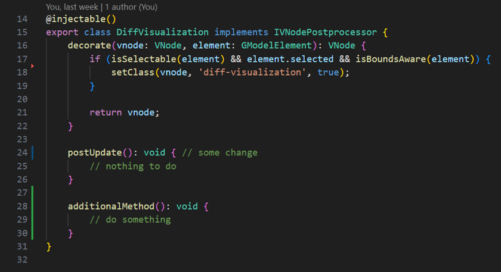
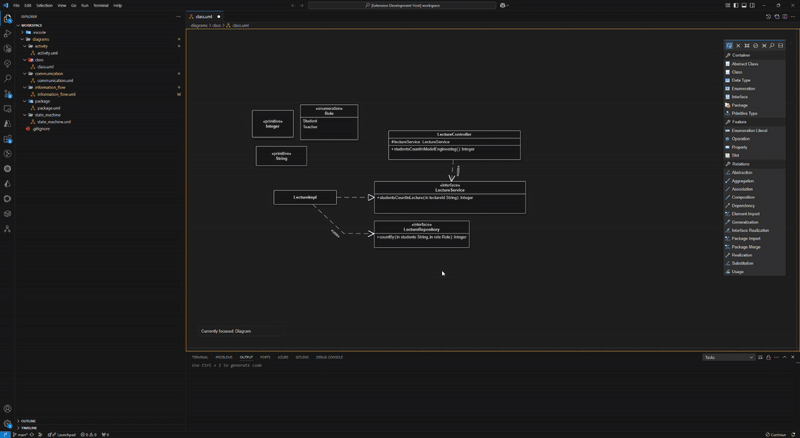
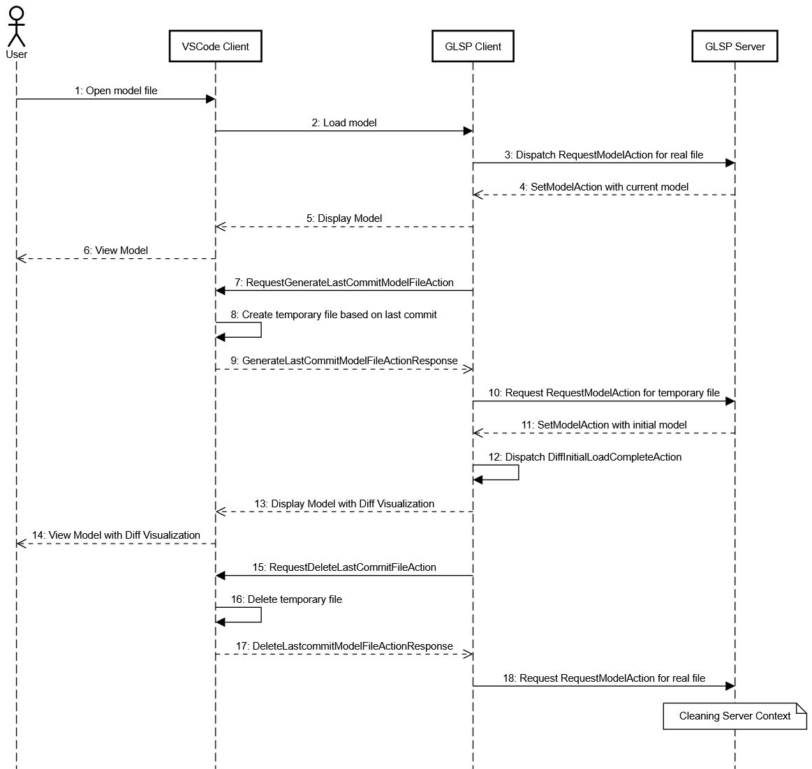
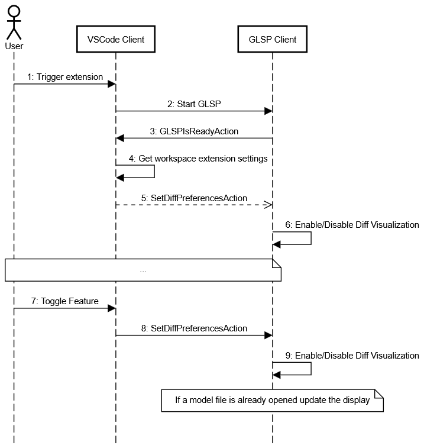

# Git Difference Visualization

## Context

Version control systems are an integral part of modern software development workflows, especially for collaborative efforts. Git is, by far, the most popular and widespread of those. So much so that it is integrated in every modern development environment, which VS Code certainly is as well.

This usually takes the form as seen above, with color coding of the changes in the file. Green signifies additions, blue changes and red deletions. Among other things, this allows developers to keep track of their progress and scope of their changes.

However, visual tools usually lack this seemless integration, and bigUML is no exception in this regard. This forfeits all the advantages of version control and forces developers to either keep track and communicate their changes manually or inspect the textual representation of the model.

This feature aims to alleviate this problem by introducing visual indicators for both additions and changes that should be intuitive for people familiar with git integrations. However, deletions are explicitly not part of the scope.

## Result

The gif showcases the functionality of the feature, which is very focused in scope:

- Marking any and all additions, whether completely new elements or simply new sub-elements, in green
- Marking any changes that are based on existing elements in blue

The feature itself can be toggled on or off using `Toggle Git-based Diff Visualization`. The purpose of the toggle is self-explanatory and therefore not explicitly showcased.

## Documentation

The general development approach can be broken down into 4 steps, each building upon the previous:

1. Loading models
2. Comparing models
3. Loading the last commit model
4. Adding a feature toggle

### Loading models

Since detecting any changes to the model necessitates having access to the model, the first task was procurring this access. This was actually more challenging than expected, since the model doesn't seem readily available, e.g. via dependency injection, which meant extensive debugging to find useful classes.

However, it turned out that this was not necessary, because the proper development style for GLSP is to work within the framework provided by the client's and server's action lifecycle (as it is documented [here](https://eclipse.dev/glsp/documentation/actionhandler/)). Meaning that an event handler listening to the right event would be provided with the model automatically, and at the right point in time.

The core class that handles everything regarding different models, i.e. comparison, is named `DiffHandler` (in `glsp-client/diff.handler.ts`) and is configured to listen to `SetModelAction`, `UpdateModelAction` and `DiffInitialLoadCompleteAction`. The first two are standard actions provided by the underlying framework that are sent after the initial model load and any changing user action in a model canvas respectively. In other words, listening to them both ensures that we always have access to the most recent version of the model.

The third action is a new custom action created to provide the `DiffHandler` with the initial model it can then use to compare against the current version. It is sent from `DiffStartup` (in `diff.startup.ts`), which is a `IDiagramStartup` and thus provides a method `postRequestModel()` that gets sent after a model was loaded when opening a canvas/file. This first version simply loaded the same model file again and sent it as the initial model, but later on this will be changed to load the last committed version.

Finally, after receiving both the initial and at least one current model, `DiffHandler` would adjust the entire model by simply adding a CSS class and triggering a rerender using `ModifyCSSFeedbackAction`. At this point, this was more of a proof of concept for coloring the current model.

### Comparing models

It turned out that comparing the models was easier than expected, because each graph element has an unique ID. This allowed for a very naive, but equally effective, method of comparing the models: Simply traversing both graphs recursively and simultaneously. As this directly concerns the comparison of models, this is found in `DiffHandler` though it would eventually be extracted to `diff.util.ts`.

If a node only exists in the current model, but not in the initial model, the conclusion is that it must have been created and should therefore receive the respective CSS class. Similar, if it exists in both but relevant attributes differ, e.g. the text for a label node, this node must have been edited and should receive the appropriate CSS class.

The only issue with this approach is that deleting and recreating the "same" element is not recognized as such, and it will be marked as a new creation. However, this could be alleviated with a kind of semantic comparison that uses more information than simply the node identity.

Another more general issue with comparison is that the size of a node may be interesting to highlight, i.e. as a result of resizing, but changing the children of a node may cause the node itself to change size. This causes a kind of visual cascade that is problematic in actual use. Therefore, the size attribute is excluded from the comparison at the cost of some events not being visualized.

### Loading the last committed model

Now we can already display the changes between models and have access to the current model at all times. The remaining issue is to access the model state at the time of the last commit.

The primary problem is that the GLSP server needs an actual model file to load, therefore we need to create a temporary file with the state of the last commit. Everything regarding files and the underlying operating system is delegated to the VSCode API. However, as GLSP is designed to be platform-agnostic, we don't have direct access to API at all points in our code, but rather have to forward actions to GLSP-VSCode client that serves as bridge between the GLSP client and VSCode.

For this purpose 2 new actions and their respective responses are created and registered to cross boundaries:

- `RequestGenerateLastCommitModelFileAction`
- `GenerateLastCommitModelFileActionResponse`
- `RequestDeleteLastCommitModelFileAction`
- `DeleteLastCommitModelFileActionResponse`

They are registered using `bind(ExtensionActionKind).toConstantValue(...)`, which signals to the action lifecycle that this is not supposed to communicate with the GLSP server but rather the VSCode extension.

The actions are named descriptively and do exactly as their name suggest. `DiffStartup` is now adjusted to only send such a `RequestGenerateLastCommitModelFileAction` and nothing more.

However, 2 new classes are added, one on the side of the VSCode client (`DiffActionHandler` in `vscode/diff.handler.ts`) and one for the GLSP client (`DiffStartupHandler` in `diff-startup.handler.ts`), that communicate with each other to create and cleanup the temporary file and eventually send the initial model using `DiffInitialLoadCompleteAction`. The sequence of events can be best explained using the following sequence diagram:

Steps 1 to 6 should be familiar as they are unchanged by this feature and simply represent the normal sequence of events necessary to render a model, though this only focus on relevant actions and is not exhaustive.

Step 7 corresponds to the aforementioned `DiffStartup` that triggers the creation of the last committed model file in step 8. For this purpose, we check that...:

- ...the file exists (as it should as it was opened)
- ...the git extension is present and activated
- ...the file is in a repository
- ...the path is properly formatted for git

Now the git extension API, obtained via the VSCode API, can be used to get the content of a file at a specific commit, namely `HEAD`. This content can then be written into a temporary file, the path of which we send back to the GLSP client using `GenerateLastCommitModelFileActionResponse` in step 9. It should be noted that we usually create 2 temporary files, one for the `.uml` file and one for the hidden `.unotation` file.

Upon receiving this response, `DiffStartupHandler` requests another model from the GLSP server in step 10, and uses the result of step 11 for a `DiffInitialLoadCompleteAction` in step 12. This means that `DiffHandler` is finally given the initial model so it from this point forward do comparisons that are then displayed on the canvas, as expressed in step 13 and 14.

However, in addition to this, `DiffStartupHandler` also sends a `RequestDeleteLastCommitModelFileAction` to the VSCode client to clean up the temporary files that are not needed anymore in step 15. Furthermore, in parallel, the current model is requested again from the server in step 18, because the GLSP server is stateful, which means that not resetting its internal model to the current state causes various issues.

The removal of the temproary files in step 16 is just a simple file deletion and the response sent in 17 is done in order to complete the action cycle. Nothing further happens due to this response.

### Adding a feature toggle

Finally, since this feature is visually rather invasive, it seemed appropriate to provide users with a toggle so it could be disabled on demand. The core idea is to use VSCode extension settings and commands to ensure the setting is persistent over sessions. Explaining the sequence of events is supported by the following sequence diagram:

The extension trigger in step 1 is configured in the `package.json`, but generally this means opening a `.uml` file or creating a new `.uml` file using a command. This automatically starts the GLSP client, which sends an `GLSPIsReadyAction` once it is set up. This is then taken as a prompt by `DiffSettingActionHandler` (in `diff-setting.handler.ts`) to read the current settings and send it to the GLSP client using a `SetDiffPreferencesAction` in steps 4 and 5.

This action is then used by the `DiffHandler` in step 6 and remembered to decide for any future comparison, whether it should be skipped or not. As this occurs on startup and necessarily no canvas has been rendered yet, this only affects internal state.

However, the setting can be actively changed by using the VSCode command `Toggle Git-based Diff Visualization` as in step 7. It changes the underlying extension setting to its opposite boolean value and then sends a `SetDiffPreferencesAction` to the GLSP client in step 8, which then reacts to this by, again, setting the internal state of `DiffHandler` for future comparisons. The only difference is that if a model should currently be displayed, it is cleaned of any additional visualization, or vice versa if the feature is re-enabled while a file is open.

## Issues

Some of the encountered issues are:

- **Moving the feature module**: Going into the architecture, it is rather confusing how a new feature should be added. I initially opted to simply add it into the base `uml-glsp-client` package in order to ensure I would see results. Only later on did I gain confidence in the structure of the project and decide to extract the feature into its own `big-diff-visualization` package.

- **Stateful GLSP server file saving**: It seems that the GLSP server is not only stateful in regard to remembering the current model, but it also seems to have direct file access and saves by unilateral authority. This lead to the temporary files being recreated even though they were already cleaned up. For this purpose, I set up a file watcher that would simply delete the temporary file again if it was recreated.

- **Difference between request and dispatch**: The difference between requesting and dispatching an action is important but very subtle and easy to miss. Requesting an action means that the resulting action response must be handled manually, whereas dispatching an action ensures that the response is part of the action cycle. This was important for requesting the initial model from the server without causing a total rerender of the canvas.

## Future work

I can think of several extensions based on this feature:

- **Deletions**: Deletions were explicitly not part of the scope, because they are very hard to properly visualize. In classic text editors a symbol indicates a removel and opens a different view displaying the deleted text. For a visual editor, this is hard because we do not want to add too many elements lest it becomes cluttered and impractical to use. However, it would maybe be possible to use a similiar approach to text editors by adding a symbol representing removal that then shows a distinct view of the removed elements.

- **Diff View**: Many git tools provide some diff view, where both versions of a file are contrasted to each other. In principle, this should not be too difficult to achieve for a visual editor. Based on this feature, one would likely only need the initial model in one view and the current in the other, then adding the appropriate coloring. This would also allow to incorporate deletions much more easily, because instead of trying to display everything in a single model, we can seperate different information to different views.

- **Semantic comparison**: As alluded to previously when discussing comparison, but instead of simply comparing the graph structure based on provided identity, it could be worthwhile to do a proper semantic comparison based on content.

## Issues with architecture

2 issues became apparent while working with the architecture:

- **Stateful server with direct resource access**: The fact that the GLSP server both is stateful and has direct resource is rather unexpected and caused multiple issues during development. Is is possible that the efficiency gains are worth the price, but it is not obvious why it would have to be this way. Therefore, some kind of warning or introduction to such details may be useful.

- **Deep knowledge of GLSP and Sprotty needed**: At multiple points during the development I ran into difficulties that I was only able to overcome by referencing the underlying GLSP and Sprotty implementation. However, accessing the sources of imports works notoriously bad in TypeScript, often ending up at the `.d.ts` file. I tended to instead debug and reference the GLSP client code I had already checked out for other projects. The GLSP client libraries should be included or referenced in some way in the repositories provided to the students. It would also be helpful to do an introduction to the stack (bigUML - GLSP - Sprotty) and its basic event cycle for displaying a model.
